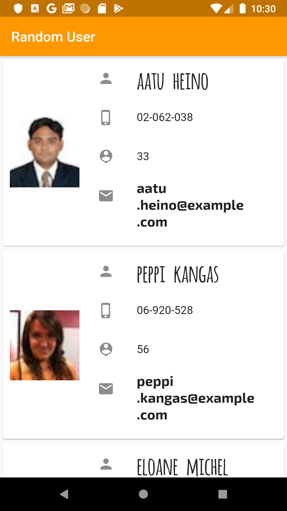
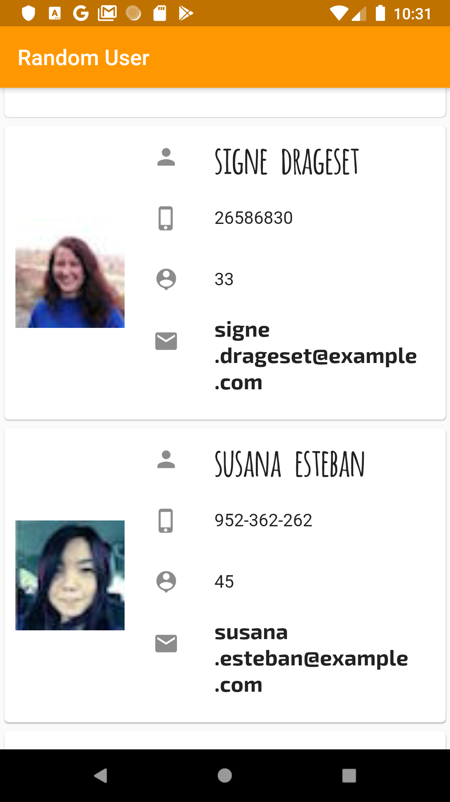

# Random User Generator

[](https://GitHub.com/Naereen/StrapDown.js/graphs/commit-activity) [](https://GitHub.com/Naereen/ama) [](https://code.visualstudio.com/) [](https://github.com/S-ayanide/Flutter-RandomUser/issues)
[](https://github.com/S-ayanide/Flutter-RandomUser/network) [](https://github.com/S-ayanide/Flutter-RandomUser/stargazers) [](https://github.com/ellerbrock/open-source-badges/)
[](https://github.com/S-ayanide/Flutter-RandomUser/blob/master/LICENSE)

This is a Flutter application which generates random users after fetching them through an API and displays them in the UI. 👦 👧
### 👉 If you like this repo then please give it a ⭐️

## Short Description
This Flutter app generates random user's Name, Mobile Number, Age and E-mail from an API request from the website [Random User](https://randomuser.me/). Everytime the app reloads it generates new sets of users.

## Screenshots
  
     
## NOTE:
This project is subject to change by the developer and is still in development

## How to run this
Running this is as simple as it gets. Follow this steps
1. Open your terminal (NOTE: git bash prefered/ Terminal on VS Code)
2. Navigate to the project folder where you have cloned this repo.
3. Open an emulator or plug in a real device
4. Type the following command in the terminal 
     ```
     flutter run
     ```

## Website Used
[Random User Website](https://randomuser.me/)
For help getting started with what dependencies you need and how to deploy it, view our [documentation](https://randomuser.me/documentation)
     
## Pull Request

Pull Requests are welcome. Please follow these rules for the ease of understanding:
* Make sure to check for available issues before raising one
* Give me a maximum of 24-48 hours to respond
* Have proper documentation on the parts you are changing/adding

#### Feel free to contribute

## Developed & Maintained by
[Sayan Mondal](https://github.com/S-ayanide) 
[📷 Insta](https://www.instagram.com/s_ayanide/)
[🐤 Twitter](https://www.instagram.com/s_ayanide/) [](https://twitter.com/intent/tweet?text=Wow:&url=https%3A%2F%2Fgithub.com%2FS-ayanide%2FFlutter-RandomUser)

## License 
[](https://github.com/S-ayanide/Flutter-RandomUser/blob/master/LICENSE)
```Copyright 2019 Sayan Mondal

Licensed under the Apache License, Version 2.0 (the "License");
you may not use this file except in compliance with the License.
You may obtain a copy of the License at

    http://www.apache.org/licenses/LICENSE-2.0

Unless required by applicable law or agreed to in writing, software
distributed under the License is distributed on an "AS IS" BASIS,
WITHOUT WARRANTIES OR CONDITIONS OF ANY KIND, either express or implied.
See the License for the specific language governing permissions and
limitations under the License.
```

## Getting Started
For help getting started with Flutter, view our online [documentation](https://flutter.dev/docs).
